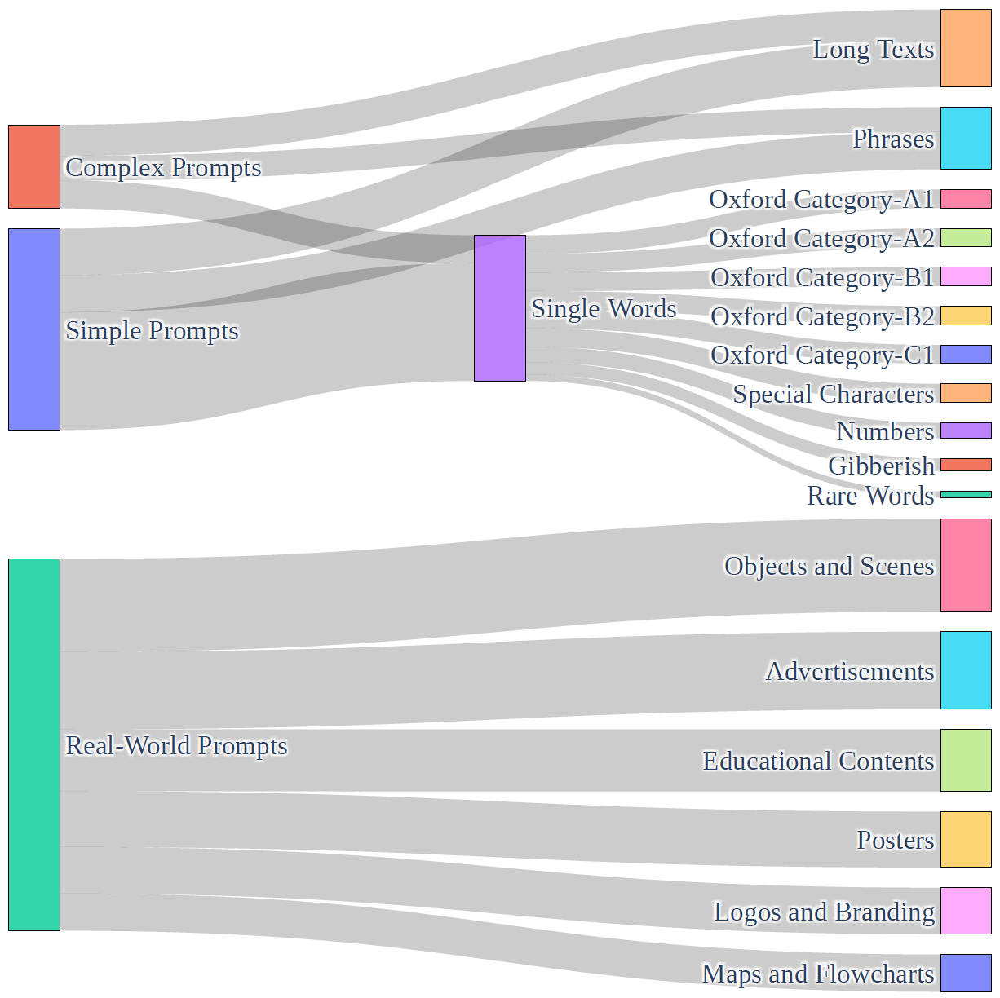
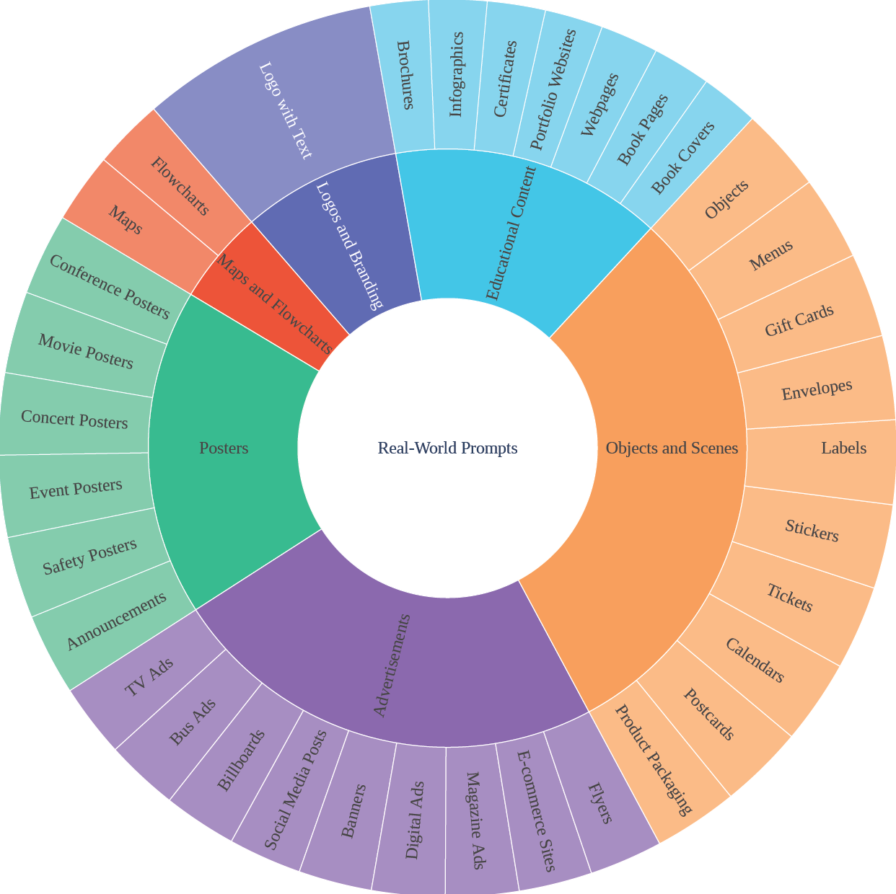

# ✨TextInVision: Text and Prompt Complexity Driven Visual Text Generation Benchmark (CVPR 2025 - BEAM Workshop)

<a href="https://arxiv.org/abs/2503.13730">
  
</a>

## News
[2023.06.11]: 🎉 TextInVision received the Best Paper Award at the CVPR2025 BEAM Workshop!

[2023.05.30]: 🎉 TextInVision has been selected for an oral presentation by the BEAM25 committee.

[2025.04.07]: 🎉 TextInVision is accepted to CVPR 2025-BEAM Workshop.

## Table of Contents
- [Overview](#overview)
- [File Structure](#file-structure)
- [Usage](#usage)

## Overview

In this work, we introduce TextInVision, a large-scale, text and prompt complexity driven benchmark designed to evaluate the ability of diffusion models to effectively integrate visual text into images.

We crafted a diverse set of prompts and texts that consider various attributes and text characteristics that can be printed on images. 

<p align="center">

</p>

Our prompt set mirrors real-world use cases, driven by word and prompt complexity and emphasizes practical applications and challenges encountered outside controlled experimental settings, establishing a new standard for evaluating image generative models in dynamic environments.

<p align="center">

</p>

Additionally, we prepared an image dataset to test Variational Autoencoder (VAE) models across different character representations, highlighting that VAE architectures can also pose challenges in text generation within diffusion frameworks. 

## File Structure

Below is a table summarizing the files in this repository:

|        **Filename**        | **Type** |                                                         **Description**                                                  |
|----------------------------|----------|--------------------------------------------------------------------------------------------------------------------------|
| `all_texts.csv`            | CSV      | Contains all text used in the TextInVision prompt set.                                                                   |
| `all_prompts.csv`          | CSV      | Contains all prompt (instruction) used within the TextInVision prompt set.                                               |
| `real_world_prompts.json`  | JSON     | Contains instructions (prompts) derived from real-world situations.                                                      |
| `vae_images_metadata.json` | JSON     | Contains metadata for images used in the TextInVision image set, including image links and additional details.           |
| `config.json`              | JSON     | Contains two sections prompts and texts. Each section contains various filter attributes combined with logical operators.|
## Usage

1. **Clone the repository**:
   ```bash
   git clone https://github.com/TextinVision/TextinVision.git

2. **Generate the Prompts JSON:**

   Update `config.json` with your desired filters and run:
   ```bash
   python prompt_text_selection.py

A sample entry in the generated JSON might look like:
   ```json
   "A cat holding a sign with the text \"Happy 25th Birthday!\" on it.": {
       "text": "Happy 25th Birthday!",
       "oxford_category": NaN,
       "char_length": 18,
       "rare": false,
       "gibberish": false,
       "spec_char": true,
       "number": true,
       "sentence": true,
       "word_length": 3,
       "LAION_freq": 0,
       "CoCo_freq": 0,
       "text_source": "OpenAI. Gpt-4o. https://chatgpt.com/, 2024.",
       "prompt_type": "simple",
       "prompt_word_length": 10,
       "prompt_char_length": 34
   }
   ```

3. **Download VAE Image Set:**

   To download images for VAE testing using the `vae_images_metadata.json` provided, run:

   ```bash
   python download_VAE_image_set.py

4. **Score Computation via Algorithm 1**
   
   The score provided to the models is computed using Algorithm 1, which integrates three distinct text similarity methods (Longest Ordered Match, Longest Common Subsequence, and Smart Levenshtein Distance) to evaluate the alignment between expected text and OCR output. 

   You need two CSV files: one for the expected text and one for the OCR output, each containing a column named "content". Then run the script and the score.csv will be generated.
    
      ```bash
   python score.py

4. **BibTeX**

```bibtex
@article{fallah2025textinvision,
  title={TextInVision: Text and Prompt Complexity Driven Visual Text Generation Benchmark},
  author={Fallah, Forouzan and Patel, Maitreya and Chatterjee, Agneet and Morariu, Vlad I and Baral, Chitta and Yang, Yezhou},
  journal={arXiv preprint arXiv:2503.13730},
  year={2025}
}
